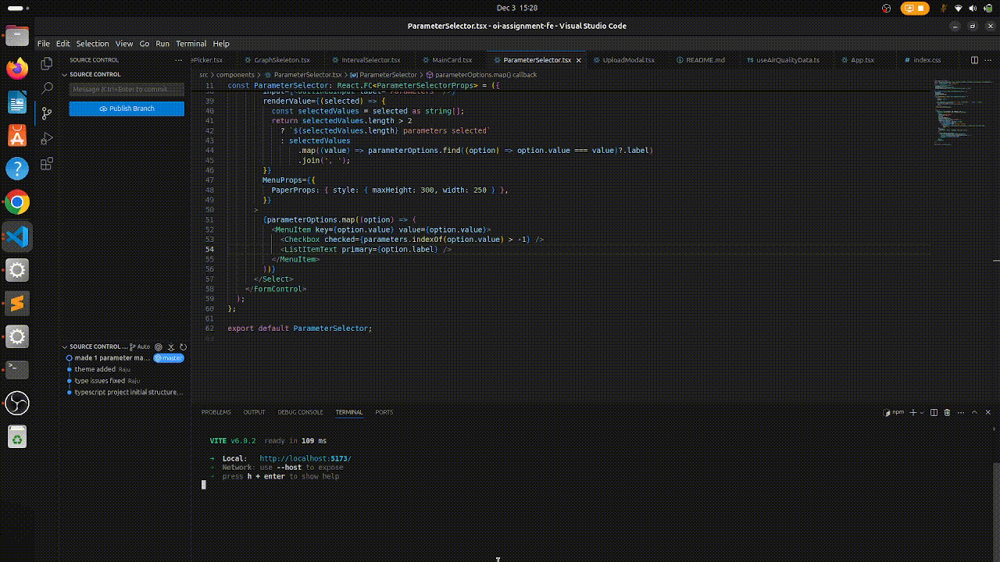

# Air Quality Dashboard

## Description

The Air Quality Dashboard is a frontend application built with React and Material-UI for visualizing air quality data. It connects to the Air Quality API backend to ingest and display data in interactive charts and tables.

## Demo


---

## Prerequisites

1. Node.js (>=16.0)
2. npm (>=8.0)

---

## Installation

1. Clone the repository:
   ```bash
   git clone https://github.com/sharmaraju352/oi-fe
   cd oi-fe
   ```
2. Install dependencies:
   ```bash
   npm install
   ```
---

## Running the Application

### Development Mode

To start the application in development mode:

```bash
npm start
```

### Production Mode

To build the application for production:

```bash
npm run build
```

To preview the production build:

```bash
npm run preview
```

---

## Features

1. **Data Visualization**:
   - Interactive line charts displaying air quality parameters over time.
   - Supports hourly and daily aggregation intervals.

2. **Data Ingestion**:
   - Upload air quality datasets in CSV format.
   - Supports batch ingestion with error handling.

3. **Filtering and Querying**:
   - Select air quality parameters to visualize.
   - Filter data by custom date ranges or predefined intervals (e.g., last 1 day, last 1 month).

4. **Pagination**:
   - Tabular data with pagination for easy browsing.

---

## Usage

### 1. Upload CSV File

To upload a CSV file, use the "Upload CSV File" button in the application. The default file `AirQualityUCI.csv` is available in the root directory and can be used for testing.


### 2. Visualize Data

1. Select parameters (e.g., CO(GT), NOx(GT)) from the dropdown menu.
2. Choose a predefined interval (e.g., 1 day, 1 month) or set a custom date range.
3. View the resulting chart and table.

---